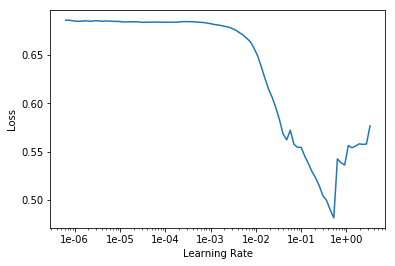
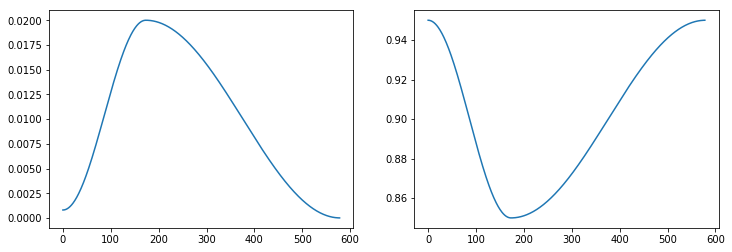

# 概要

本記事はfast.aiのwikiの[Callbacks](https://docs.fast.ai/callbacks.html#List-of-callbacks)ページの要約となります。  
筆者の理解した範囲内で記載します。

公式ドキュメントには、

`fastai's training loop is highly extensible, with a rich callback system. `

とありますが、要は
**fast.aiのトレーニングループの中において、拡張性の高いcallbackシステムが組み込まれています。**

`Every callback that is passed to Learner with the callback_fns parameter will be automatically stored as an attribute. `

仕組みとしては、Learnerに`callback_fns`として引き渡された全てのcallbackは自動的に属性として呼び出すことができるようになっているらしい。

それでは、  

1. LrFinder
2. OneCycleScheduler
3. MixUpCallback
4. CSVLogger
5. SaveModelCallback  

以上の5つの実例を見ていきましょう。

# LrFinder

MNISTデータを用いる場合、

```python
path = untar_data(URLs.MNIST_SAMPLE)
data = ImageDataBunch.from_folder(path)
def simple_learner(): return Learner(data, simple_cnn((3,16,16,2)), metrics=[accuracy])
learn = simple_learner()
```

```python
learn.lr_find()
```

```python
learn.recorder.plot()
```

  

Leslie Smith氏が考案なさった[learning rate finder](https://www.jeremyjordan.me/nn-learning-rate/)を用いて最適な学習率を探し出すことができます。  
この場合、グラフの谷底の少し後ろの`lr = 2e-2`が最適なLearning Rateだそう。（後日記事にて詳細を解説します。）  

# OneCycleScheduler

Leslie Smith氏の[1cycle annealing](https://sgugger.github.io/the-1cycle-policy.html)を実装したもの。

```python
learn.fit_one_cycle(3, lr)
```

```python
learn.recorder.plot_lr(show_moms=True)
```

  

詳しくは[こちら](https://docs.fast.ai/callbacks.one_cycle.html)を参照。  
要は、Learning Rate と Momentum を反比例してtrainingしていく感じだと思う。

# MixUpCallback

```python
learn = Learner(data, simple_cnn((3, 16, 16, 2)), metrics=[accuracy]).mixup()
```

[Mixup: Beyond Empirical Risk Minimization](https://arxiv.org/abs/1710.09412)も同様に実装することができる。

# CSVLogger

```python
learn = Learner(data, simple_cnn((3, 16, 16, 2)), metrics=[accuracy, error_rate], callback_fns=[CSVLogger])
```

```python
learn.fit(3)
```

```python
learn.csv_logger.read_logged_file()
```

`callback_fns`に`[CSVLogger]`を付けるだけでこんな簡単に結果をcsvに出力できる。  

# SaveModelCallback

```python
learn = Learner(data, simple_cnn((3,16,16,2)), metrics=accuracy)
learn.fit_one_cycle(3,1e-4, callbacks=[SaveModelCallback(learn, every='epoch', monitor='accuracy')])
```

```python
!ls ~/.fastai/data/mnist_sample/models
```

> bestmodel_1.pth  bestmodel_2.pth  bestmodel_3.pth

こんな感じで毎epoch、もしくは最適なmodelを自動的に保存することができます！！すげえ！！

# 最後に

1. 他にも面白いcallbacksがあったのでpart2で紹介できていければと思います。
2. Learning Rate Finder や Mixup などの理論的背景を深掘りしていきたい。
3. 自作のモデルのチュートリアルをやってみる。

最後に  
間違いやご指摘などが御座いましたらご教示願います！