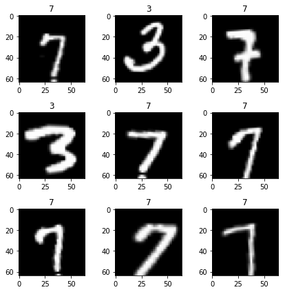
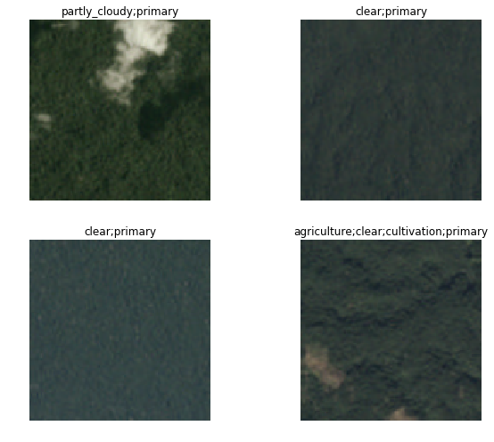
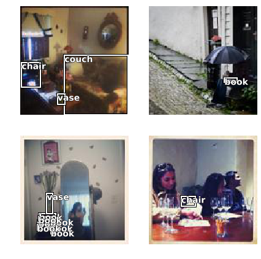
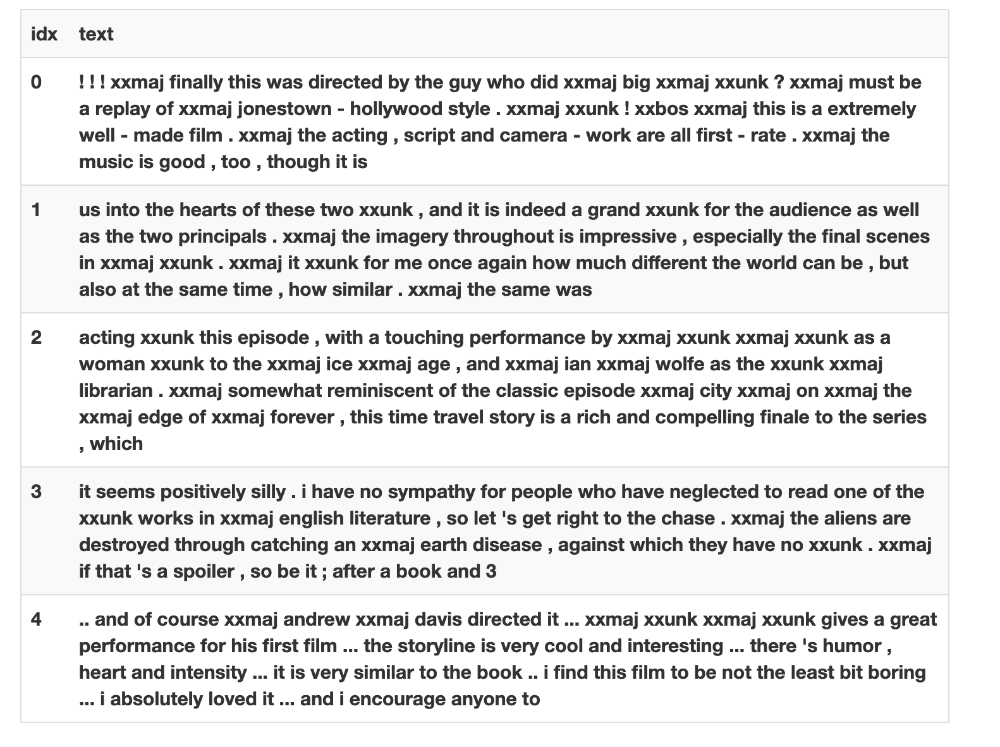
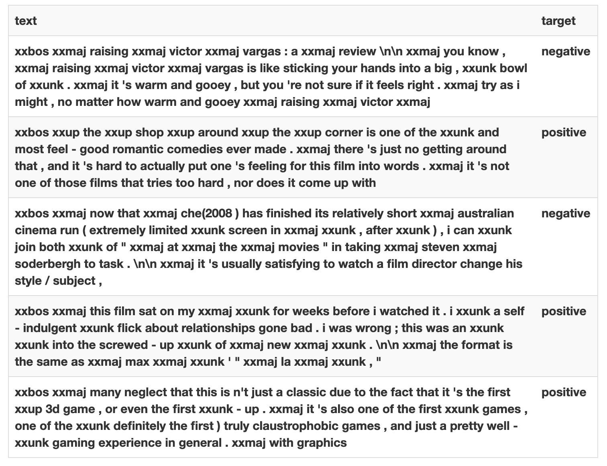
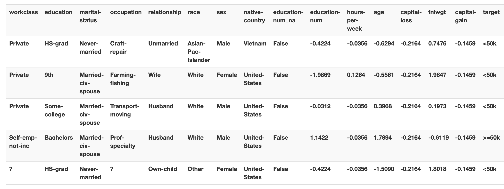

# 概要

本記事はfast.aiのwikiの[Data Block](https://docs.fast.ai/data_block.html)ページの要約となります。  
筆者の理解した範囲内で記載します。

training, validation, testに用いるデータの読み込みを行うための[DataBunch](https://docs.fast.ai/basic_data.html#DataBunch)の設定をわずか数行のコードで行うことができる！

## 細かく設定できる非常にフレキシブルなAPI

今回は以下の7つの例を用いていきます。

1. Binary Classification
2. Multi Label Classification
3. Mask Segmentation
4. Object Detection
5. Text Language Model
6. Text Classification
7. Tabular

## 1. [Binary Classification] 最初に、MNISTを用いた例を挙げていきます。

```python
from fastai.vision import *
```

```python
path = untar_data(URLs.MNIST_TINY)
tfms = get_transforms(do_flip=False)
path.ls()
```

```python
(path/'train').ls()
```

### 肝心のDataBlockは下から！

```python
data = (ImageList.from_folder(path)     #どこからのデータか? -> pathの中のフォルダとサブフォルダで、ImageList
        .split_by_folder()              #train/validをどのように分けるか? -> フォルダをそのまま用いる
        .label_from_folder()            #labelをどのように付けるか? -> フォルダの名前から転用する
        .add_test_folder()              #testを付け足す
        .transform(tfms, size=64)       #Data augmentationを用いるか? -> size64のtfmsを用いる
        .databunch())                   #DataBunchへと変換する
```

DataBlockを実際に読み込んで出力してみましょう

```python
data.show_batch(3, figsize=(6,6), hide_axis=False)
```



すげええええ、本当にたった数行でtrain/validation/testに分けてdata augmentation用いたdatabunchを作成できた！

## 2. [Multi Label Classification] 次は、planetを用いた例を挙げていきます。

```python
planet = untar_data(URLs.PLANET_TINY)
planet_tfms = get_transforms(flip_vert=True, max_lighting=0.1, max_zoom=1.05, max_warp=0.)
```

```python
data = (ImageList.from_csv(planet, 'labels.csv', folder='train', suffix='.jpg')
        #どこからのデータか? -> planet内のtrainフォルダで、ImageList
        .random_split_by_pct()
        #train/validをどのように分けるか? -> ランダムでdefaultの20%の割合でvalidへ
        .label_from_df(label_delim=' ')
        #labelをどのように付けるか? -> csvファイルを用いる
        .transform(planet_tfms, size=128)
        #Data augmentationを用いるか?-> size128のtfmsを用いる
        .databunch())
        #DataBunchへと変換する
```

同様にDataBlockを実際に読み込んで出力してみましょう

```python
data.show_batch(rows=2, figsize=(9,7))
```



きちんとmulti-label-classificationが読み込めていますね。

## 3. [Mask Segmentation] camvidを用いた例を挙げていきます。

```python
camvid = untar_data(URLs.CAMVID_TINY)
path_lbl = camvid/'labels'
path_img = camvid/'images'
```

```python
codes = np.loadtxt(camvid/'codes.txt', dtype=str); codes
```

labelを付け足す関数を自作します。

```python
get_y_fn = lambda x: path_lbl/f'{x.stem}_P{x.suffix}'
```

`tfm_y＝True`によって、data_augmentationが元々のmaskにも適用されるそう。

```python
data = (SegmentationItemList.from_folder(path_img)
        #どこからのデータか? -> path_imgで、SegmentationItemList
        .random_split_by_pct()
        #train/validをどのように分けるか? -> ランダムでdefaultの20%の割合でvalidへ
        .label_from_func(get_y_fn, classes=codes)
        #labelをどのように付けるか? -> get_y_func
        .transform(get_transforms(), tfm_y=True, size=128)
        #Data augmentationを用いるか?-> Standard transforms で tfm_y=True, size=128を指定
        .databunch())
        #DataBunchへと変換する
```

出力します。

```python
data.show_batch(rows=2, figsize=(7,5))
```


簡単すぎ、、なのにすげええええ
どんどんいきます。

## 4. [Object Detection] cocoを用いた例を挙げます。

```python
coco = untar_data(URLs.COCO_TINY)
images, lbl_bbox = get_annotations(coco/'train.json')
img2bbox = dict(zip(images, lbl_bbox))
get_y_func = lambda o:img2bbox[o.name]
```

```python
data = (ObjectItemList.from_folder(coco)
        #どこからのデータか? -> cocoで、ObjectItemList
        .random_split_by_pct()
        #train/validをどのように分けるか? -> ランダムでdefaultの20%の割合でvalidへ
        .label_from_func(get_y_func)
        #labelをどのように付けるか? -> get_y_func
        .transform(get_transforms(), tfm_y=True)
        #Data augmentationを用いるか?-> Standard transforms で tfm_y=True
        .databunch(bs=16, collate_fn=bb_pad_collate))
        #DataBunchへと変換する -> bb_pad_collateによって一部のbbを出力
```

```python
data.show_batch(rows=2, ds_type=DatasetType.Valid, figsize=(6,6))
```



細かい設定をいじって非常にフレキシブルなAPIですね

## 5. [Text Language Model] IMDBを用いた例を挙げます。

```python
from fastai.text import *
```

```python
imdb = untar_data(URLs.IMDB_SAMPLE)
```

```python
data_lm = (TextList.from_csv(imdb, 'texts.csv', cols='text')
        #どこからのデータか? -> imdb の'texts.csv'のなかの'text'column で、TextList
        .random_split_by_pct()
        #train/validをどのように分けるか? -> ランダムでdefaultの20%の割合でvalidへ
        .label_for_lm()
        #labelをどのように付けるか? -> Language Modelから
        .databunch())
        #DataBunchへと変換する
```

```python
data_lm.show_batch()
```



これだけでLanguage Modelを鍛えることができます。

### 6. [Text Classification] IMDBを用いた例を挙げます。

上のLanguage Modelを延長して、

```python
data_clas = (TextList.from_csv(imdb, 'texts.csv', cols='text')
        #どこからのデータか? -> imdb の'texts.csv'のなかの'text'column  で、TextList
        .split_from_df(col='is_valid')
        #train/validをどのように分けるか? -> 'is_valid' column にて分割
        .label_from_df(cols='label')
        #labelをどのように付けるか? -> 'label' column dfを参照する
        .databunch())
        #DataBunchへと変換する
```

完成！

```python
data_clas.show_batch()
```



### 7. [Text Classification] IMDBを用いた例を挙げます。

```python
from fastai.tabular import *
```

```python
adult = untar_data(URLs.ADULT_SAMPLE)
df = pd.read_csv(adult/'adult.csv')
dep_var = 'salary'
cat_names = ['workclass', 'education', 'marital-status', 'occupation', 'relationship', 'race', 'sex', 'native-country']
cont_names = ['education-num', 'hours-per-week', 'age', 'capital-loss', 'fnlwgt', 'capital-gain']
procs = [FillMissing, Categorify, Normalize]
```

```python
data = (TabularList.from_df(df, path=adult, cat_names=cat_names, cont_names=cont_names, procs=procs)
        #どこからのデータか? -> dfからのTabular List
        .split_by_idx(valid_idx=range(800,1000))
        #train/validをどのように分けるか? -> val_idxの800から1000
        .label_from_df(cols=dep_var)
        #labelをどのように付けるか? -> dep var＝ターゲットを用いる
        .databunch())
        #DataBunchへと変換する
```

```python
data.show_batch()
```



# 個人的な振り返り

1. 継続的にアウトプットすることでfast.aiの理解度を深め, fast.ai の掲げているdemocratizationへ寄与する。
2. より深い部分のコードを解説していく。
3. 次回、DataBlockのより細かい設定のAPIを解説していこうと思います。

最後に  
間違いやご指摘などが御座いましたらご教示願います！