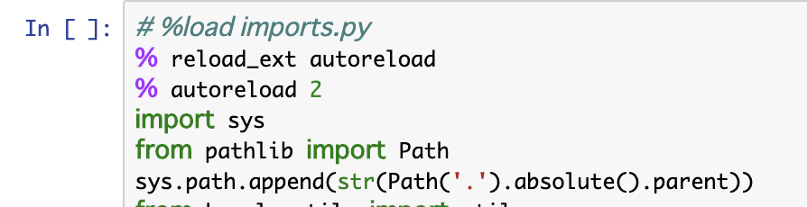

# 【Kaggle日記】 1日目

## 目標

今年中にKaggle Expertになることを目指しております！

## バックグラウンド

春から文系の大学3年生です。
プログラミング・機械学習経験ゼロの状態から去年の夏頃fast.aiをきっかけに機械学習に触れ始めました。
ここ3ヶ月ほど、Kaggleに挑戦しようと試みたのですが、毎度のことhigh-scoring-kernelを模写して終わることが続きました。。。
そもそも、kernel模写してても分からないことだらけで手も足も出ず。。
このままではマズイと思い、
一念発起して【Kaggle日記】始めます！

## 挑戦するのは【Santander Customer Transaction Prediction】

データの容量が比較的小さく参加者が多いということもあって、4/11がcloseの
【Santander Customer Transaction Prediction】
に挑戦します。

## 概要

Kaggleのルールに違反しない範囲内でその日取り組んで

1. できるようになったこと
2. 学んだことのアウトプット
3. やったこと

を記して行こうと思います。

## 1. できるようになったこと

### Jupyter Notebook における `%load imports.py`

毎回最初に同じコードをコピペするのは億劫だったので、

`%load imports.py`

を実行すると

のように全て`imports.py`のコードがロードしてくれます！

### Pandas Profiling

#### 参考

- https://naotaka1128.hatenadiary.jp/entry/kaggle-challenge-story#anchor19
- https://qiita.com/h_kobayashi1125/items/02039e57a656abe8c48f

#### 概要

`conda install -c conda-forge pandas-profiling`

だいぶ時間はかかりましたが、interactiveに１つ１つの特徴を把握しました

### OOF

#### 参考

https://www.kaggle.com/questions-and-answers/52606
https://www.kaggle.com/serigne/stacked-regressions-top-4-on-leaderboard
https://www.kaggle.com/getting-started/18153#post103381

## 2. 学んだことのアウトプット

## 3. やったこと

### 文献一覧

- https://medium.com/@rrfd/jupyter-notebook-shortcuts-tips-and-tricks-top-nbextensions-bring-order-to-your-notebooks-pt-636eb8ee5f89
- https://www.dataquest.io/blog/jupyter-notebook-tips-tricks-shortcuts/
- http://threeprogramming.lolipop.jp/blog/?p=964

### Youtube 文献

- https://www.youtube.com/watch?v=CPqOCI0ahss

